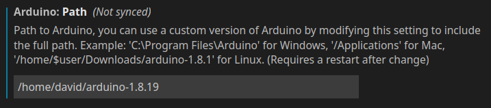

# Wheelchair

This repository holds the code developed for Systems Engineering @FEUP in 2022/2023.
Its purpose is to control an electric wheelchair and, using sensors, avoid collisions.

---
## Windows development dependencies

- [Arduino IDE](https://www.arduino.cc/en/software)
- Choco package manager (install instructions [here](#make))
- Make (install instructions [here](#choco-package-manager))
- [Visual Studio Code](https://code.visualstudio.com/) (Optional)

## Linux development dependencies

- [Arduino IDE](https://www.arduino.cc/en/software)
- [Visual Studio Code](https://code.visualstudio.com/) (Optional)

---

## Development

Prepare development environment

```console
make dev-setup
```

Running tests

```console
make test
```

---

## Deployment

ssh into Jetson Nano, then:

```console
git clone 
cd wheelchair
```

```console
make jetson-setup
make jetson-install
```

To start the app service:

```console
sudo systemctl start wheelchair.service
```

To make it run always (once it boots):

```console
sudo systemctl enable wheelchair.service
```

---

## Arduino Development Environment

- ### VsCode extension

Install the official Arduino extension:

Name: Arduino \
Id: vsciot-vscode.vscode-arduino \
Description: Arduino for Visual Studio Code \
Version: 0.4.12 \
Publisher: Microsoft \
VS Marketplace Link: <https://marketplace.visualstudio.com/items?itemName=vsciot-vscode.vscode-arduino>

- ### Set the arduino.path (folder of Arduino app installation)

VsCode -> Settings -> Extensions -> Arduino configuration -> Arduino: path



If these are not already set, on the bottom bar of VsCode click on:

- \<Select programmer> and choose AVRISP mkII,
- \<Select board> and choose Arduino Mega or Mega 2560

## Build for Arduino

Connect the Arduino and click on \<Select Serial Port> (bottom bar),
selecting the serial port that corresponds to its connection.

With any file ending in .ino open, click on the top right buttons to verify or upload code.
Alternatively, you might click F1 and write the commands "Arduino: Verify" or "Arduino: Upload" and press the Enter key.

### Arduino Unit Test library

Press F1 and write "Arduino: Library Manager".
Look for a library called arduinounit and install it.
<https://github.com/mmurdoch/arduinounit/>

---

## Installation instructions

### Choco Package Manager

Open Powershell as admin and run:

```console
Get-ExecutionPolicy
```

If it returns "`Restricted`", then run

```console
Set-ExecutionPolicy AllSigned or Set-ExecutionPolicy Bypass -Scope Process.
```

Then, run this to install choco

```console
Set-ExecutionPolicy Bypass -Scope Process -Force; [System.Net.ServicePointManager]::SecurityProtocol = [System.Net.ServicePointManager]::SecurityProtocol -bor 3072; iex ((New-Object System.Net.WebClient).DownloadString('https://community.chocolatey.org/install.ps1'))
```

### Make

(needs Choco to be installed)

```console
choco install make
```

## Standards

### C++

- The class name should be a noun.
- Use upper case letters as word separators, lower case for the rest of the word in the class name.
The first character in the class name must be upper case.
- No underscores (‘_’) are permitted in the class name.
- The private attribute name in class should be prepended with the character ‘m’.
- After prepending ‘m’, the same rules will be followed for the name like that for the class name.
- Character ‘m’ also precedes other name modifiers also. For example, ‘p’ for pointers.
Each method/ function name should begin with a verb.
- The first character of function/ method argument names should be lower case. All words starting after the first letter should be the upper case with class names.
- The variable name should begin with an alphabet.
- Digits may be used in the variable name but only after the alphabet.
- No special symbols can be used in variable names except for the underscore(‘_’).
- No keywords can be used for variable names.
- Pointer variables should be prepended with ‘p’ and place the asterisk ‘*’ close to the variable name instead of pointer type.
- Reference variables should be prepended with ‘r’. This helps to differentiate between the method returning a modifiable object and the same method returning a non-modifiable object.
- Static variables should be prepended with ‘s’.
- The global constants should be all capital letters separated with ‘_’.
- No special character is allowed in the file name except for underscore (‘_’) and dash (‘-‘).
- The file name should end with the .cc extension in the end or should end with the .cpp extension.
- Do not use filenames that already exist in /user/include. or any predefined header file name.
